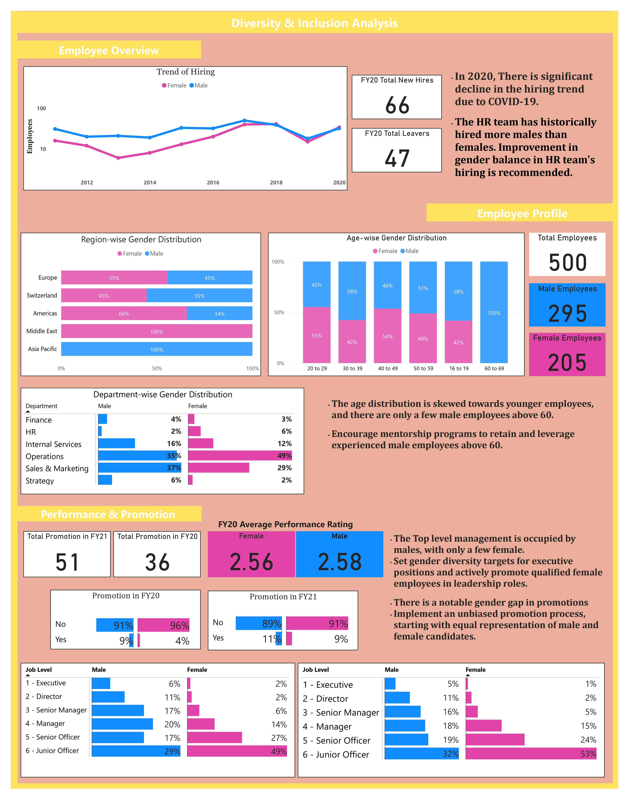

# Diversity_Inclusion_Dashboard
# Diversity and Inclusion Analysis Dashboard



This repository contains the Diversity and Inclusion Analysis Dashboard, a part of my Forage PwC virtual case study. The objective of this project is to analyze and visualize diversity and inclusion trends within an organization. The dashboard presents insightful visualizations based on the provided data.

## Objective

The primary objective of this analysis is to gain valuable insights into the organization's diversity and inclusion efforts. By examining various aspects such as employee hiring trends, demographic representation, promotions, and performance ratings, we aim to identify areas that require attention and improvement.

## Insights

The following are the key insights derived from the analysis:

### 1. Employee Hiring Trends

- The number of employees hired increased rapidly after 2015 and decreased rapidly in 2019. This decline might be attributed to the COVID-19 pandemic, impacting hiring activities.
- The data indicates a gender disparity in hiring, with the number of male employees hired consistently higher than the number of female employees hired.

### 2. Demographic Representation

- Females from Europe and Switzerland dominate the new hires, particularly in the 40-49 age group.
- Female hires tend to be more inclined towards part-time employment compared to their male counterparts.
- Nearly 50% of the female new hires are mainly in the Operations department, whereas only 3% are in Finance & HR. This suggests the need for greater female representation in these departments.
- It appears that employees from the Asia-Pacific region are predominantly male, while those from the Middle East are predominantly female. This indicates the importance of including people from diverse regions and age groups to foster a more inclusive environment.

### 3. Promotions and Performance Ratings

- The average performance rating in FY20 seems to have dropped compared to FY19 ratings, raising potential concerns about performance management.
- More employees have been promoted in FY21 compared to FY20, which could be a positive sign of growth and career advancement within the organization.
- A notable observation is that no female employee has been promoted consecutively. Furthermore, female employees mostly occupy lower-grade positions, such as Junior officers, with only 1% holding executive-level positions. This highlights the necessity of promoting gender diversity in leadership roles.

## Recommendations

Based on the insights obtained from the analysis, the following recommendations are proposed to enhance diversity and inclusion within the organization:

1. **Gender-Balanced Hiring:** Implement strategies to achieve a better gender balance in hiring practices, ensuring equal opportunities for both male and female candidates.

2. **Inclusive Regional Representation:** Encourage diversity by actively seeking talent from various regions, promoting cross-cultural understanding, and creating an inclusive work environment.

3. **Promotion and Career Development:** Establish measures to ensure fair and equitable promotions, providing opportunities for professional growth and development for all employees, regardless of gender.

4. **Performance Management:** Investigate the drop in average performance ratings in FY20 and take appropriate measures to improve performance management systems.

5. **Leadership Diversity:** Implement initiatives to promote and support female employees in pursuing leadership roles, fostering a more diverse and inclusive leadership team.

## How to Use the Dashboard

To use the Diversity and Inclusion Analysis Dashboard, follow these steps:

1. Clone the repository to your local machine using the following command:
```
git clone https://github.com/Rbhavika17/Diversity_Inclusion_Dashboard.git
```

2. Open the `index.html` file in your web browser to access the dashboard.

3. Explore the various visualizations and insights presented in the dashboard to gain a comprehensive understanding of the organization's diversity and inclusion landscape.

Please note that the dashboard is based on the provided data, and any changes to the underlying dataset may require appropriate modifications to the analysis code.

## Feedback and Contributions

Feedback and contributions are welcome and highly appreciated. If you have any suggestions or would like to contribute to the project, please open an issue or submit a pull request on the repository.

Thank you for your interest in the Diversity and Inclusion Analysis Dashboard! Together, we can foster a more inclusive workplace that values and embraces diversity.
